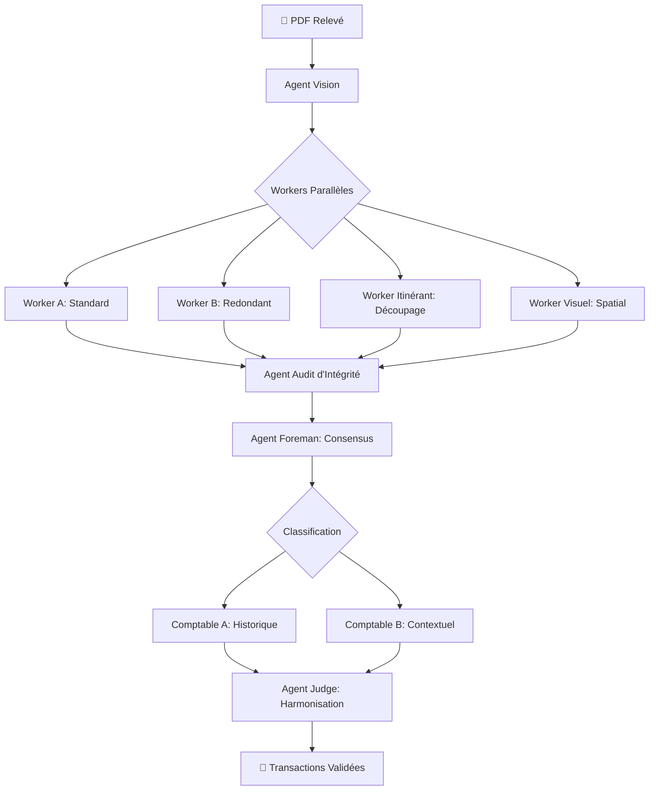

# 📊 AssoCompta AI

> [!IMPORTANT]
> **PROJET EN COURS DE DÉVELOPPEMENT**
> Cette application est actuellement en phase active de développement (V2). Certaines fonctionnalités peuvent être instables et l'interface est sujette à des modifications fréquentes.

[](https://github.com/jknebel/Association_compta)
[](https://fastapi.tiangolo.com/)
[](https://reactjs.org/)
[](https://ai.google.dev/)
[](http://creativecommons.org/licenses/by-nc/4.0/)

**AssoCompta AI** est une solution intelligente de gestion comptable automatisée pour les associations. En utilisant des systèmes multi-agents (LangGraph) et la puissance des LLM (Gemini), le projet vise à éliminer la saisie manuelle fastidieuse en transformant des documents bruts en écritures comptables structurées.

---

## ✨ Fonctionnalités Clés

- **🤖 Pipeline Multi-Agents (LangGraph)** : Extraction robuste des relevés bancaires avec double vérification (Workers A/B) et audit d'intégrité.
- **📄 Vision Intelligence** : Analyse visuelle des reçus et factures pour extraire montants, dates et libellés.
- **🧠 Apprentissage par l'Historique** : Système de classification intelligent qui apprend de vos validations passées pour suggérer les bons comptes.
- **💬 Chat Expert** : Posez des questions sur votre comptabilité en langage naturel et obtenez des réponses basées sur vos données réelles.
- **📊 Ledger Dynamique** : Visualisation en temps réel de la balance, filtrage intelligent et export Excel.
- **🔒 Sécurisé & Cloud** : Authentification et stockage temps réel via Firebase.

---

## 🏗️ Architecture du Pipeline AI

Le cœur du projet repose sur un graphe d'agents collaboratifs orchestrés par **LangGraph**. Ce système garantit une précision maximale même sur des PDF complexes de plusieurs pages.



---

## 🛠️ Stack Technique

| Composant | Technologie |
| :--- | :--- |
| **Frontend** | React 18, Vite, TypeScript, Tailwind CSS, Lucide Icons |
| **Backend** | FastAPI (Python 3.12), LangChain, LangGraph |
| **IA / LLM** | Google Gemini 2.0 Flash (Vision & Text) |
| **Data / Auth** | Firebase (Firestore, Auth, Storage) |
| **Traitement PDF** | PyMuPDF (fitz) |
| **Déploiement** | Docker, Google Cloud Run |

---

## 🚀 Installation & Configuration

### Prérequis
- Python 3.10+ & Node.js 18+
- Un projet Firebase configuré
- Une clé API [Google AI Studio](https://aistudio.google.com/)

### 1. Backend
```bash
cd backend
python -m venv venv
source venv/bin/activate  # Windows: venv\Scripts\activate
pip install -r requirements.txt
```
Créez un `.env` dans le dossier `backend` :
```env
GOOGLE_API_KEY=votre_cle_gemini
# Pour Firebase, utilisez l'ADC ou placez serviceAccountKey.json
```

### 2. Frontend
```bash
npm install
npm run dev
```
Créez un `.env.local` à la racine :
```env
VITE_FIREBASE_API_KEY=...
VITE_FIREBASE_AUTH_DOMAIN=...
VITE_FIREBASE_PROJECT_ID=...
# ... autres configs Firebase
```

---

## 🐳 Docker
Le projet peut être conteneurisé facilement :
```bash
docker build -t assocompta-backend ./backend
docker run -p 8000:8000 assocompta-backend
```
## 📄 Licence
Ce projet est mis à disposition selon les termes de la Licence Creative Commons Attribution - Pas d’Utilisation Commerciale 4.0 International.

En résumé :

✅ Autorisé : L'utilisation, la modification et la distribution de ce code pour des associations à but non lucratif, des étudiants, ou pour des projets personnels.

❌ Interdit : Toute utilisation de ce code ou de cette application à des fins commerciales (générer des revenus, vendre un service basé sur ce projet) sans accord préalable explicite de l'auteur.

Pour plus de détails, veuillez consulter le fichier LICENSE à la racine de ce dépôt.
---

## 🤝 Contribution
Les contributions sont les bienvenues ! Pour des changements majeurs, veuillez d'abord ouvrir une issue pour discuter de ce que vous aimeriez changer.

---
*Développé avec ❤️ pour simplifier la gestion associative.*
