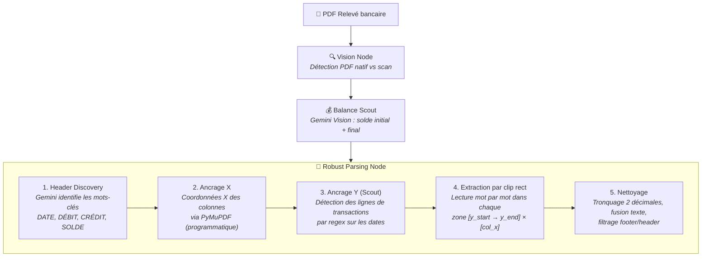
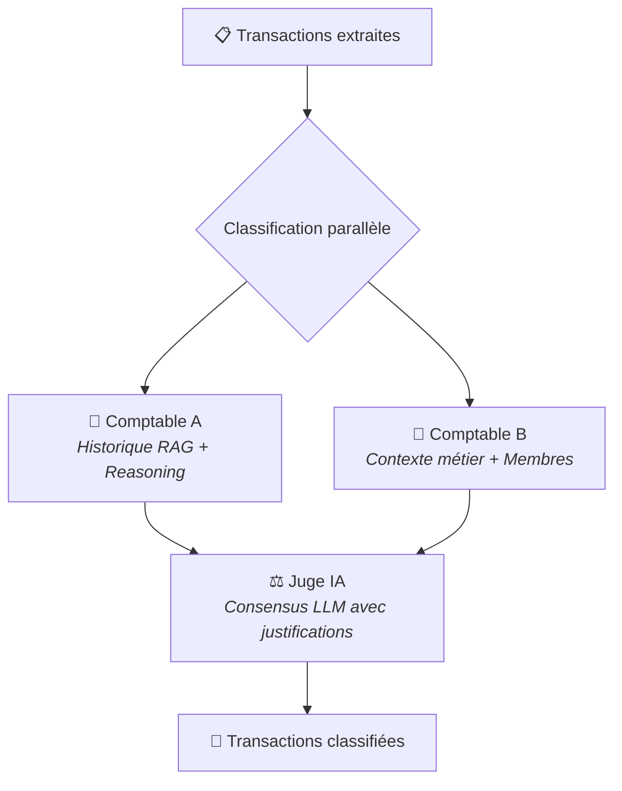

# 📊 AssoCompta AI

> [!IMPORTANT]
> **PROJET EN COURS DE DÉVELOPPEMENT**
> Cette application est actuellement en phase active de développement (V2). Certaines fonctionnalités peuvent être instables et l'interface est sujette à des modifications fréquentes.

[](https://github.com/jknebel/Association_compta)
[](https://fastapi.tiangolo.com/)
[](https://reactjs.org/)
[](https://ai.google.dev/)
[](http://creativecommons.org/licenses/by-nc/4.0/)

**AssoCompta AI** est une solution intelligente de gestion comptable automatisée pour les associations. En utilisant des systèmes multi-agents (LangGraph) et la puissance des LLM (Gemini), le projet vise à éliminer la saisie manuelle fastidieuse en transformant des relevés bancaires PDF en écritures comptables structurées et classifiées.

---

## ✨ Fonctionnalités Clés

- **🤖 Pipeline d'Extraction Robuste** : Extraction déterministe des relevés bancaires par ancrage spatial (coordonnées X/Y) directement sur le PDF natif, sans dépendance à l'OCR IA pour les données chiffrées.
- **📐 Calibration IA des Colonnes** : Gemini identifie automatiquement les en-têtes de colonnes (Date, Débit, Crédit, Solde) puis le parser programmatique extrait les valeurs avec précision sub-pixel.
- **📚 Apprentissage par l'Historique (RAG)** : Système de classification intelligent qui apprend de vos validations passées pour catégoriser automatiquement les écritures récurrentes.
- **🧠 Raisonnement IA Avancé (Chain of Thought)** : Deux agents classifieurs indépendants justifient chaque choix de compte, et un Juge IA tranche les divergences.
- **🎯 Contexte Métier Dynamique** : Injection de règles spécifiques (cotisations, gestion des membres) directement dans l'invite des agents via un contexte global configurable dans l'UI.
- **📄 Vision Intelligence** : Analyse visuelle des reçus et factures pour extraire montants, dates et libellés, avec matching automatique aux transactions.
- **💬 Chat Expert** : Posez des questions sur votre comptabilité en langage naturel et obtenez des réponses basées sur vos données réelles.
- **📊 Ledger Dynamique** : Visualisation en temps réel de la balance, filtrage intelligent et export Excel.
- **🔒 Sécurisé & Cloud** : Authentification et stockage temps réel via Firebase.

---

## 🏗️ Architecture du Pipeline AI

Le pipeline de traitement des relevés bancaires se décompose en **deux phases séquentielles** : une extraction déterministe puis une classification par consensus IA.

### Phase 1 — Extraction (Déterministe + IA légère)



**Détails des étapes :**

| Étape | Agent | Méthode | Description |
|:---:|:---|:---|:---|
| 1 | **Vision Node** | PyMuPDF | Vérifie si le PDF contient du texte natif (> 200 chars). Si oui, traitement direct. Sinon, fallback OCR via Gemini Vision. |
| 2 | **Balance Scout** | Gemini Vision | Envoie l'image de la première et dernière page pour extraire les soldes initial et final (ancres de validation). |
| 3 | **Header Discovery** | Gemini Flash (structured output) | Reçoit la liste de tous les mots de la page 1 avec leurs coordonnées X. Identifie les labels de colonnes (ex: "Valeur", "Débits", "Crédits", "Solde"). |
| 4 | **Ancrage X** | Programmatique (PyMuPDF) | Utilise les mots identifiés par l'IA pour calculer les bornes X exactes de chaque colonne (x_min, x_max basé sur le centre + largeur configurable). |
| 5 | **Ancrage Y** | Programmatique (Regex) | Parcourt chaque page et détecte les positions Y de chaque date (format `dd.mm.yy`) dans la zone X de la colonne Date. Chaque Y = début d'une transaction. |
| 6 | **Extraction** | PyMuPDF `clip rect` | Pour chaque transaction : découpe un rectangle `[y_start, y_next]` × `[0, page_width]`, lit les mots, et les assigne aux colonnes selon leur position X. Les montants ne sont capturés que s'ils sont **alignés verticalement avec la date** (marge de 10px). |
| 7 | **Nettoyage** | Python | Tronquage des montants à 2 décimales sans arrondi, fusion des mots du descriptif, extraction de la date depuis le texte, filtrage des lignes de résumé (Report, Chiffre d'affaires, Total). |

### Phase 2 — Classification (IA Multi-Agents)



| Agent | Rôle | Spécialité |
|:---|:---|:---|
| **Comptable A** | Classification par historique | Récupère les 200 dernières transactions validées par l'utilisateur (RAG Firestore) et les utilise comme exemples pour le LLM. |
| **Comptable B** | Classification par contexte | Se concentre sur les descriptions de comptes, les comptes de cotisation (isMembership), et la détection de noms de membres dans les libellés. |
| **Juge IA** | Arbitrage final | Reçoit les propositions + raisonnements de A et B, puis tranche pour chaque transaction. Privilégie B pour les cotisations, A pour les récurrences historiques. |

---

## 📄 Association des Pièces Comptables (Reçus & Factures)

Le système inclut un moteur d'intelligence visuelle capable de lier automatiquement un document justificatif (image ou PDF) à une transaction bancaire existante.

### 1. Extraction Visuelle (Vision Node)
Le document est analysé par **Gemini Vision** pour extraire :
- Le montant total TTC.
- La date d'émission.
- Le nom du marchand ou prestataire.
- Le type de document (Facture standard vs Avoir/Remboursement).

### 2. Algorithme de Matching Multi-Critères
Une fois les données extraites, le backend scanne les transactions non liées pour trouver la meilleure correspondance via un système de score :

- **Montant (Critère bloquant)** : Le montant doit correspondre exactement (marge de 0.05 CHF). Le système inverse automatiquement le signe selon s'il s'agit d'un achat (Débit) ou d'un remboursement (Crédit).
- **Date (Score +++)** : Bonus de score important si la date du reçu correspond exactement à la date de l'opération bancaire.
- **Contenu (Score ++)** : Recherche textuelle du nom du marchand (extrait du reçu) dans le libellé brut de la transaction bancaire (`fullRawText`).
- **Départage** : En cas d'égalité, le système sélectionne la transaction la plus proche chronologiquement.

---

## 🛠️ Stack Technique

| Composant | Technologie |
| :--- | :--- |
| **Frontend** | React 18, Vite, TypeScript, Tailwind CSS, Lucide Icons |
| **Backend** | FastAPI (Python 3.12), LangChain, LangGraph |
| **IA / LLM** | Google Gemini 2.5 Flash (Vision & Structured Output) |
| **Data / Auth** | Firebase (Firestore, Auth, Storage) |
| **Traitement PDF** | PyMuPDF (fitz) — extraction native sans OCR |
| **Déploiement** | Docker, Google Cloud Run |

---

## 🚀 Installation & Configuration

### Prérequis
- Python 3.10+ & Node.js 18+
- Un projet Firebase configuré
- Une clé API [Google AI Studio](https://aistudio.google.com/)

### 1. Backend
```bash
cd backend
python -m venv venv
source venv/bin/activate  # Windows: venv\Scripts\activate
pip install -r requirements.txt
```
Créez un `.env` dans le dossier `backend` :
```env
GOOGLE_API_KEY=votre_cle_gemini
# Pour Firebase, utilisez l'ADC ou placez serviceAccountKey.json
```

### 2. Frontend
```bash
npm install
npm run dev
```
Créez un `.env.local` à la racine :
```env
VITE_FIREBASE_API_KEY=...
VITE_FIREBASE_AUTH_DOMAIN=...
VITE_FIREBASE_PROJECT_ID=...
# ... autres configs Firebase
```

---

## 🐳 Docker
Le projet peut être conteneurisé facilement :
```bash
docker build -t assocompta-backend ./backend
docker run -p 8000:8000 assocompta-backend
```
## 📄 Licence
Ce projet est mis à disposition selon les termes de la Licence Creative Commons Attribution - Pas d’Utilisation Commerciale 4.0 International.

En résumé :

✅ Autorisé : L'utilisation, la modification et la distribution de ce code pour des associations à but non lucratif, des étudiants, ou pour des projets personnels.

❌ Interdit : Toute utilisation de ce code ou de cette application à des fins commerciales (générer des revenus, vendre un service basé sur ce projet) sans accord préalable explicite de l'auteur.

Pour plus de détails, veuillez consulter le fichier LICENSE à la racine de ce dépôt.
---

## 🤝 Contribution
Les contributions sont les bienvenues ! Pour des changements majeurs, veuillez d'abord ouvrir une issue pour discuter de ce que vous aimeriez changer.

---
*Développé avec ❤️ pour simplifier la gestion associative.*
