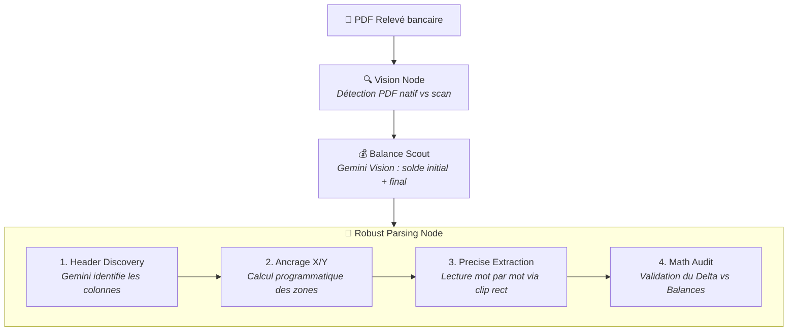
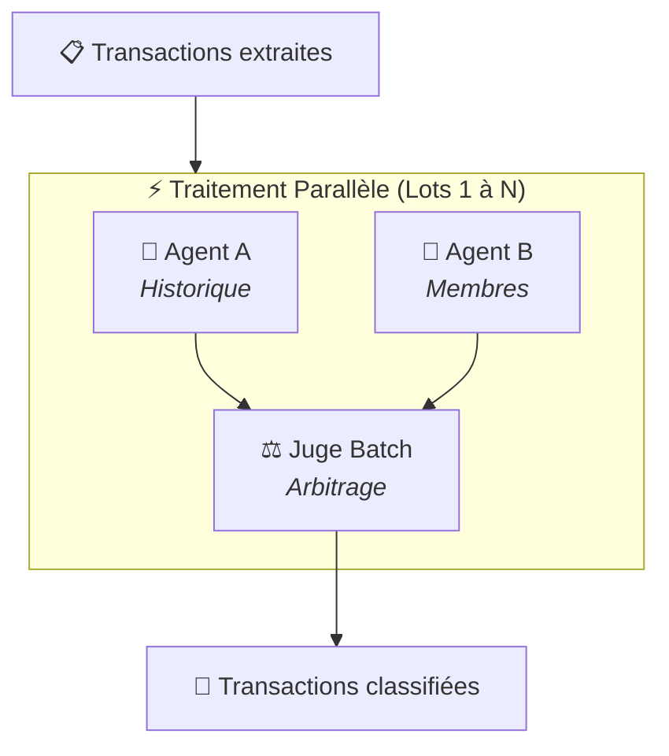

# 📊 AssoCompta AI

> [!IMPORTANT]
> **PROJET EN COURS DE DÉVELOPPEMENT**
> Cette application est actuellement en phase active de développement (V2). Certaines fonctionnalités peuvent être instables et l'interface est sujette à des modifications fréquentes.

[](https://github.com/jknebel/Association_compta)
[](https://fastapi.tiangolo.com/)
[](https://reactjs.org/)
[](https://ai.google.dev/)
[](http://creativecommons.org/licenses/by-nc/4.0/)

**AssoCompta AI** est une solution intelligente de gestion comptable automatisée pour les associations. En utilisant des systèmes multi-agents (LangGraph) et la puissance de **Gemini 2.5 Flash**, le projet transforme des relevés bancaires PDF complexes en écritures comptables structurées en quelques secondes.

---

## ✨ Fonctionnalités Clés

- **🤖 Pipeline d'Extraction Robuste** : Extraction déterministe des relevés bancaires par ancrage spatial (coordonnées X/Y) directement sur le PDF natif.
- **📐 Calibration IA des Colonnes** : Gemini identifie automatiquement les en-têtes (Date, Débit, Crédit, Solde) puis le parser programmatique extrait les valeurs avec précision sub-pixel.
- **⚡ Unified Parallel Batch Consensus** : Classification ultra-rapide par lots de 10 transactions traitées en parallèle, garantissant la fiabilité sans risque de timeout.
- **📚 Apprentissage par l'Historique (RAG)** : Système de classification qui apprend de vos validations passées (Firestore) pour catégoriser les écritures récurrentes.
- **🧠 Triple Consensus par Lot** : Pour chaque groupe de 10 transactions, deux agents (Historique vs Membres) proposent un choix, et un Juge IA arbitre le consensus.
- **🎯 Contexte Métier Dynamique** : Injection de règles spécifiques (cotisations, gestion des membres) via un contexte global configurable.
- **📄 Vision Intelligence** : Analyse visuelle des reçus et factures avec matching automatique aux transactions bancaires.
- **💬 Chat Expert** : Posez des questions sur votre comptabilité en langage naturel et obtenez des réponses basées sur vos données réelles.
- **📊 Ledger Dynamique** : Visualisation en temps réel de la balance, filtrage intelligent et export Excel.
- **🔒 Sécurisé & Cloud** : Authentification et stockage temps réel via Firebase.

---

## 🏗️ Architecture du Pipeline AI

### Phase 1 — Extraction (Déterministe + IA légère)



### Phase 2 — Classification (Parallel Batch Consensus)



| Agent | Rôle | Spécialité |
|:---|:---|:---|
| **Consensus Batch** | Traitement Parallèle | Divise les transactions en lots de 10 pour éviter les timeouts. Chaque lot est traité de manière autonome et concurrente. |
| **Comptable A** | Historique RAG | Utilise les 200 dernières écritures validées pour assurer la cohérence temporelle. |
| **Comptable B** | Contexte Membres | Détecte les noms des membres et applique les règles métier (cotisations, dons). |
| **Juge Batch** | Arbitrage Final | Compare A et B pour chaque transaction du lot. Tranche en faveur de l'historique ou du métier selon la pertinence des justifications. |

---

## 📄 Association des Pièces Comptables (Reçus & Factures)

Le système inclut un moteur d'intelligence visuelle capable de lier automatiquement un document justificatif (image ou PDF) à une transaction bancaire existante.

### 1. Extraction Visuelle (Vision Node)
Le document est analysé par **Gemini Vision** pour extraire :
- Le montant total TTC.
- La date d'émission.
- Le nom du marchand ou prestataire.
- Le type de document (Facture standard vs Avoir/Remboursement).

### 2. Algorithme de Matching Multi-Critères
Une fois les données extraites, le backend scanne les transactions non liées pour trouver la meilleure correspondance via un système de score :

- **Montant (Critère bloquant)** : Le montant doit correspondre exactement (marge de 0.05 CHF). Le système inverse automatiquement le signe selon s'il s'agit d'un achat (Débit) ou d'un remboursement (Crédit).
- **Date (Score +++)** : Bonus de score important si la date du reçu correspond exactement à la date de l'opération bancaire.
- **Contenu (Score ++)** : Recherche textuelle du nom du marchand (extrait du reçu) dans le libellé brut de la transaction bancaire (`fullRawText`).
- **Départage** : En cas d'égalité, le système sélectionne la transaction la plus proche chronologiquement.

---

## 🛠️ Stack Technique

| Composant | Technologie |
| :--- | :--- |
| **Frontend** | React 18, Vite, TypeScript, Tailwind CSS, Lucide Icons |
| **Backend** | FastAPI (Python 3.12), LangChain, LangGraph |
| **IA / LLM** | Google Gemini 2.5 Flash (Vision & Structured Output) |
| **Data / Auth** | Firebase (Firestore, Auth, Storage) |
| **Traitement PDF** | PyMuPDF (fitz) — extraction native sans OCR |
| **Déploiement** | Docker, Google Cloud Run |

---

## 🚀 Installation & Configuration

### Prérequis
- Python 3.10+ & Node.js 18+
- Un projet Firebase configuré
- Une clé API [Google AI Studio](https://aistudio.google.com/)

### 1. Backend
```bash
cd backend
python -m venv venv
source venv/bin/activate  # Windows: venv\Scripts\activate
pip install -r requirements.txt
```
Créez un `.env` dans le dossier `backend` :
```env
GOOGLE_API_KEY=votre_cle_gemini
# Pour Firebase, utilisez l'ADC ou placez serviceAccountKey.json
```

### 2. Frontend
```bash
npm install
npm run dev
```
Créez un `.env.local` à la racine :
```env
VITE_FIREBASE_API_KEY=...
VITE_FIREBASE_AUTH_DOMAIN=...
VITE_FIREBASE_PROJECT_ID=...
# ... autres configs Firebase
```

---

## 🐳 Docker
Le projet peut être conteneurisé facilement :
```bash
docker build -t assocompta-backend ./backend
docker run -p 8000:8000 assocompta-backend
```
## 📄 Licence
Ce projet est mis à disposition selon les termes de la Licence Creative Commons Attribution - Pas d’Utilisation Commerciale 4.0 International.

En résumé :

✅ Autorisé : L'utilisation, la modification et la distribution de ce code pour des associations à but non lucratif, des étudiants, ou pour des projets personnels.

❌ Interdit : Toute utilisation de ce code ou de cette application à des fins commerciales (générer des revenus, vendre un service basé sur ce projet) sans accord préalable explicite de l'auteur.

Pour plus de détails, veuillez consulter le fichier LICENSE à la racine de ce dépôt.
---

## 🤝 Contribution
Les contributions sont les bienvenues ! Pour des changements majeurs, veuillez d'abord ouvrir une issue pour discuter de ce que vous aimeriez changer.

---
*Développé avec ❤️ pour simplifier la gestion associative.*
